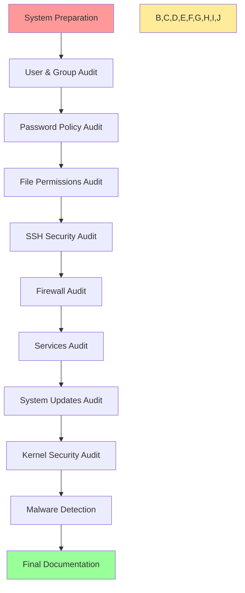
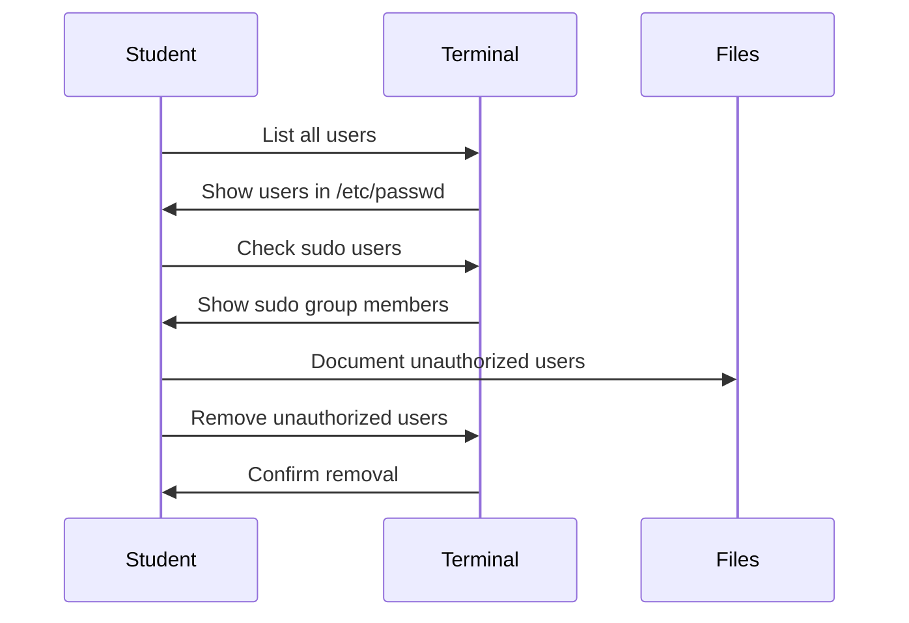

# Linux Security Audit Manual Cheat Sheet

## Competition Image Manual Audit Workflow (Ubuntu/Mint)

**🎯 Purpose:** Manual step-by-step security audit for students who cannot run automation  
**📋 Target:** Ubuntu/Mint competition images  
**⏱️ Estimated Time:** 2-3 hours for complete audit  
**👥 Team Size:** 2-4 students recommended  

---

## 🔄 Workflow Overview



---

## 📋 Pre-Audit Checklist

### ✅ Initial Setup (5 minutes)
```bash
# 1. Open terminal (Ctrl+Alt+T)
# 2. Gain root access
sudo -i

# 3. Create audit workspace
mkdir -p /tmp/audit_$(date +%Y%m%d_%H%M)
cd /tmp/audit_$(date +%Y%m%d_%H%M)

# 4. Create documentation files
touch findings.txt
touch fixes_applied.txt
touch users_found.txt
touch services_found.txt

# 5. Record system information
echo "=== SYSTEM AUDIT START ===" > findings.txt
echo "Date: $(date)" >> findings.txt
echo "Hostname: $(hostname)" >> findings.txt
echo "OS: $(lsb_release -d)" >> findings.txt
echo "Kernel: $(uname -r)" >> findings.txt
echo "User: $(whoami)" >> findings.txt
echo "=========================" >> findings.txt
```

---

## 👥 Section 1: Users & Groups Audit (20 minutes)

### 🎯 Sequence Diagram


### 📝 Manual Commands & Checks

#### 1.1 List All Users (2 minutes)
```bash
# Command: Show all user accounts
cat /etc/passwd | cut -d: -f1 | sort

# Command: Show only human users (UID >= 1000)
awk -F: '$3 >= 1000 {print $1 " (UID:" $3 ")"}' /etc/passwd

# Command: Check for users with empty passwords
awk -F: '($2 == "") {print $1}' /etc/shadow

# ✅ CHECKPOINT: Record all users in users_found.txt
cat /etc/passwd | cut -d: -f1 > users_found.txt
```

#### 1.2 Check Administrative Users (5 minutes)
```bash
# Command: List sudo group members
getent group sudo | cut -d: -f4 | tr ',' '\n'

# Command: List admin group members  
getent group admin | cut -d: -f4 | tr ',' '\n' 2>/dev/null

# Command: Check wheel group (some systems)
getent group wheel | cut -d: -f4 | tr ',' '\n' 2>/dev/null

# Command: Find users with UID 0 (root privileges)
awk -F: '$3 == 0 {print $1}' /etc/passwd

# ✅ ACTION REQUIRED: Compare with competition requirements
# Remove unauthorized sudo users:
# sudo deluser USERNAME sudo
```

#### 1.3 Validate User Accounts (8 minutes)
```bash
# Command: Check for duplicate UIDs
awk -F: '{print $3}' /etc/passwd | sort -n | uniq -d

# Command: Check for duplicate usernames
cut -d: -f1 /etc/passwd | sort | uniq -d

# Command: Find users with no home directory
while read user home; do 
    if [ ! -d "$home" ]; then 
        echo "Missing home: $user ($home)"
    fi
done < <(awk -F: '{print $1 " " $6}' /etc/passwd)

# Command: Check password status for all users
for user in $(cut -d: -f1 /etc/passwd); do
    passwd -S $user 2>/dev/null | grep -E "(NP|L)"
done

# ✅ CHECKPOINT: Document findings
echo "=== USER AUDIT RESULTS ===" >> findings.txt
echo "Total users: $(wc -l < /etc/passwd)" >> findings.txt
echo "Sudo users: $(getent group sudo | cut -d: -f4 | tr ',' '\n' | wc -l)" >> findings.txt
```

#### 1.4 Remove Unauthorized Users (5 minutes)
```bash
# ⚠️ DANGER ZONE: Only remove users NOT in competition requirements
# Command: Remove user completely
# sudo userdel -r USERNAME

# Command: Remove user from sudo group (safer)
# sudo deluser USERNAME sudo

# Command: Lock user account (reversible)
# sudo passwd -l USERNAME

# ✅ DOCUMENT: Record all removed users
echo "Removed users: [list here]" >> fixes_applied.txt
```

---

## 🔐 Section 2: Password Policy Audit (15 minutes)

### 🎯 Key Files to Check
- `/etc/pam.d/common-password`
- `/etc/login.defs`
- `/etc/security/pwquality.conf`

### 📝 Manual Commands & Checks

#### 2.1 Check Current Password Policies (5 minutes)
```bash
# Command: Check password aging settings
grep -E "PASS_(MAX|MIN|WARN)_AGE" /etc/login.defs

# Command: Check password complexity rules
grep -v "^#" /etc/security/pwquality.conf | grep -v "^$"

# Command: Check PAM password settings
grep -E "pam_pwquality|pam_unix" /etc/pam.d/common-password

# ✅ CHECKPOINT: Current settings documented?
```

#### 2.2 Verify Password Requirements (5 minutes)
```bash
# Command: Test password complexity (manual test)
echo "Test weak password checking:"
echo "Try setting a weak password on test user to verify rules work"

# Command: Check if passwords are being enforced
grep "enforce_for_root" /etc/security/pwquality.conf

# Command: Look for password history settings
grep "remember=" /etc/pam.d/common-password
```

#### 2.3 Fix Password Policies (5 minutes)
```bash
# ⚡ COMMON FIXES NEEDED:

# Fix 1: Set password aging in /etc/login.defs
sudo sed -i 's/PASS_MAX_AGE.*/PASS_MAX_AGE 90/' /etc/login.defs
sudo sed -i 's/PASS_MIN_AGE.*/PASS_MIN_AGE 1/' /etc/login.defs
sudo sed -i 's/PASS_WARN_AGE.*/PASS_WARN_AGE 7/' /etc/login.defs

# Fix 2: Enable password complexity in /etc/security/pwquality.conf
echo "minlen = 12" | sudo tee -a /etc/security/pwquality.conf
echo "minclass = 3" | sudo tee -a /etc/security/pwquality.conf

# ✅ DOCUMENT: Record changes made
echo "Password policies updated: $(date)" >> fixes_applied.txt
```

---

## 📂 Section 3: File Permissions Audit (25 minutes)

### 🎯 Critical Files Checklist
```
□ /etc/passwd (644)
□ /etc/shadow (640)  
□ /etc/group (644)
□ /etc/hosts (644)
□ /boot/grub/grub.cfg (600)
□ SSH keys (~/.ssh/*)
```

### 📝 Manual Commands & Checks

#### 3.1 Check Critical System Files (10 minutes)
```bash
# Command: Check permissions of critical files
ls -l /etc/passwd /etc/shadow /etc/group /etc/hosts

# Command: Find world-writable files (SECURITY RISK)
find /etc /bin /sbin /usr -type f -perm -002 2>/dev/null

# Command: Find SUID files (potential risk)
find / -type f -perm -4000 2>/dev/null | head -20

# Command: Find SGID files  
find / -type f -perm -2000 2>/dev/null | head -20

# ✅ CHECKPOINT: Document dangerous permissions
echo "=== FILE PERMISSIONS AUDIT ===" >> findings.txt
```

#### 3.2 Check SSH Key Permissions (5 minutes)
```bash
# Command: Find all SSH directories
find /home -name ".ssh" -type d 2>/dev/null

# Command: Check SSH key permissions
for sshdir in $(find /home -name ".ssh" -type d 2>/dev/null); do
    echo "=== $sshdir ==="
    ls -la "$sshdir/"
done

# Command: Fix SSH permissions (if needed)
# chmod 700 /home/user/.ssh
# chmod 600 /home/user/.ssh/id_*
# chmod 644 /home/user/.ssh/*.pub
```

#### 3.3 Find World-Writable Directories (5 minutes)
```bash
# Command: Find world-writable directories
find / -type d -perm -002 2>/dev/null | grep -v "/proc\|/sys\|/run"

# Command: Check for files in /tmp
ls -la /tmp/

# Command: Check for unusual files in system directories
find /etc /bin /sbin -newer /etc/passwd 2>/dev/null
```

#### 3.4 Fix File Permissions (5 minutes)
```bash
# ⚡ COMMON FIXES:

# Fix critical file permissions
sudo chmod 644 /etc/passwd
sudo chmod 640 /etc/shadow  
sudo chmod 644 /etc/group
sudo chmod 644 /etc/hosts

# Fix boot files
sudo chmod 600 /boot/grub/grub.cfg 2>/dev/null

# ✅ DOCUMENT: Record permission fixes
echo "File permissions fixed: $(date)" >> fixes_applied.txt
```

---

## 🔒 Section 4: SSH Security Audit (15 minutes)

### 📝 SSH Configuration Checklist
```
□ SSH Protocol 2 only
□ Root login disabled  
□ Password authentication (check requirements)
□ Port not default (22)
□ Strong ciphers only
□ Login banner configured
```

### 📝 Manual Commands & Checks

#### 4.1 Check SSH Service Status (2 minutes)
```bash
# Command: Check if SSH is running
systemctl status ssh
# or
systemctl status sshd

# Command: Check SSH is listening
netstat -tlnp | grep :22
```

#### 4.2 Audit SSH Configuration (8 minutes)
```bash
# Command: Backup SSH config
sudo cp /etc/ssh/sshd_config /etc/ssh/sshd_config.backup

# Command: Check critical SSH settings
grep -E "^(Protocol|PermitRootLogin|PasswordAuthentication|Port|PubkeyAuthentication)" /etc/ssh/sshd_config

# Command: Check for dangerous settings
grep -E "^(PermitEmptyPasswords|X11Forwarding|AllowUsers|DenyUsers)" /etc/ssh/sshd_config

# ✅ CHECKPOINT: Document current SSH settings
echo "=== SSH CONFIGURATION ===" >> findings.txt
grep -E "^[^#]" /etc/ssh/sshd_config >> findings.txt
```

#### 4.3 Harden SSH Configuration (5 minutes)
```bash
# ⚡ COMMON SSH FIXES:

# Set secure SSH options (check competition requirements first!)
sudo sed -i 's/#Protocol.*/Protocol 2/' /etc/ssh/sshd_config
sudo sed -i 's/#PermitRootLogin.*/PermitRootLogin no/' /etc/ssh/sshd_config
sudo sed -i 's/#PermitEmptyPasswords.*/PermitEmptyPasswords no/' /etc/ssh/sshd_config

# Restart SSH service
sudo systemctl restart ssh

# ✅ DOCUMENT: Record SSH changes
echo "SSH hardened: $(date)" >> fixes_applied.txt
```

---

## 🔥 Section 5: Firewall Audit (10 minutes)

### 📝 Manual Commands & Checks

#### 5.1 Check Firewall Status (3 minutes)
```bash
# Command: Check UFW status
sudo ufw status verbose

# Command: Check iptables rules (if UFW not used)
sudo iptables -L -n

# Command: Check listening ports
netstat -tlnp
```

#### 5.2 Configure Basic Firewall (7 minutes)
```bash
# ⚡ BASIC UFW SETUP:

# Enable UFW
sudo ufw --force enable

# Default policies
sudo ufw default deny incoming
sudo ufw default allow outgoing

# Allow SSH (adjust port if needed)
sudo ufw allow 22/tcp

# Allow specific services (check competition requirements)
# sudo ufw allow 80/tcp   # HTTP
# sudo ufw allow 443/tcp  # HTTPS

# Check final status
sudo ufw status numbered

# ✅ DOCUMENT: Record firewall configuration
echo "Firewall configured: $(date)" >> fixes_applied.txt
```

---

## ⚙️ Section 6: Services Audit (20 minutes)

### 📝 Manual Commands & Checks

#### 6.1 List All Running Services (5 minutes)
```bash
# Command: List all active services
systemctl list-units --type=service --state=active

# Command: List all enabled services
systemctl list-unit-files --type=service --state=enabled

# Command: Check for suspicious services
systemctl list-units --type=service | grep -E "(bitcoin|tor|p2p|mining)"

# ✅ CHECKPOINT: Document all services
systemctl list-units --type=service --state=active > services_found.txt
```

#### 6.2 Check Network Services (10 minutes)
```bash
# Command: Check what's listening on network
ss -tlnp

# Command: Identify processes using network
sudo lsof -i

# Command: Check for unauthorized servers
netstat -tlnp | grep -E ":(21|23|25|53|80|110|143|443|993|995)"

# ✅ ACTION: Compare with allowed services list
echo "=== NETWORK SERVICES AUDIT ===" >> findings.txt
netstat -tlnp >> findings.txt
```

#### 6.3 Disable Risky Services (5 minutes)
```bash
# ⚡ COMMON SERVICES TO DISABLE:

# Check and disable if not needed (verify first!)
services_to_check="telnet vsftpd apache2 nginx avahi-daemon cups bluetooth"

for service in $services_to_check; do
    if systemctl is-active --quiet $service; then
        echo "Found active service: $service"
        # sudo systemctl stop $service
        # sudo systemctl disable $service
    fi
done

# ✅ DOCUMENT: Record service changes
echo "Services disabled: [list here]" >> fixes_applied.txt
```

---

## 🔄 Section 7: System Updates Audit (10 minutes)

### 📝 Manual Commands & Checks

#### 7.1 Check Update Status (5 minutes)
```bash
# Command: Update package list
sudo apt update

# Command: Check available updates
apt list --upgradable

# Command: Check security updates specifically
sudo unattended-upgrade --dry-run

# ✅ CHECKPOINT: Document update status
echo "=== SYSTEM UPDATES ===" >> findings.txt
echo "Available updates: $(apt list --upgradable 2>/dev/null | wc -l)" >> findings.txt
```

#### 7.2 Apply Critical Updates (5 minutes)
```bash
# ⚠️ COMPETITION RULE: Check if updates are allowed!

# Command: Install security updates only
sudo unattended-upgrade

# Command: Install all updates (if allowed)
# sudo apt upgrade -y

# ✅ DOCUMENT: Record updates applied
echo "Updates applied: $(date)" >> fixes_applied.txt
```

---

## 🛡️ Section 8: Kernel & System Security (15 minutes)

### 📝 Manual Commands & Checks

#### 8.1 Check Kernel Parameters (5 minutes)
```bash
# Command: Check current kernel parameters
sysctl net.ipv4.ip_forward
sysctl net.ipv4.conf.all.accept_redirects
sysctl net.ipv4.conf.all.send_redirects
sysctl kernel.dmesg_restrict

# Command: Check for custom sysctl settings
cat /etc/sysctl.conf | grep -v "^#" | grep -v "^$"
```

#### 8.2 Harden Kernel Settings (10 minutes)
```bash
# ⚡ COMMON KERNEL HARDENING:

# Create or update sysctl configuration
sudo tee -a /etc/sysctl.d/99-security.conf << 'EOF'
# Network security
net.ipv4.ip_forward = 0
net.ipv4.conf.all.accept_redirects = 0
net.ipv4.conf.all.send_redirects = 0
net.ipv4.conf.all.accept_source_route = 0
net.ipv4.conf.all.log_martians = 1

# Memory protection
kernel.dmesg_restrict = 1
kernel.kptr_restrict = 2
EOF

# Apply settings
sudo sysctl -p /etc/sysctl.d/99-security.conf

# ✅ DOCUMENT: Record kernel hardening
echo "Kernel hardened: $(date)" >> fixes_applied.txt
```

---

## 🦠 Section 9: Basic Malware Detection (15 minutes)

### 📝 Manual Commands & Checks

#### 9.1 Check for Suspicious Processes (5 minutes)
```bash
# Command: List all processes
ps aux

# Command: Check for high CPU/memory usage
top -b -n1 | head -20

# Command: Look for suspicious process names
ps aux | grep -E "(bitcoin|miner|tor|nc|ncat)"

# Command: Check process tree
pstree -p
```

#### 9.2 Check for Suspicious Files (5 minutes)
```bash
# Command: Find recently modified files
find / -type f -mtime -1 2>/dev/null | grep -v "/proc\|/sys\|/run" | head -20

# Command: Find unusual executables in temp directories
find /tmp /var/tmp -type f -executable 2>/dev/null

# Command: Check for hidden files in user directories
find /home -name ".*" -type f 2>/dev/null | grep -v ".bash\|.profile\|.cache"
```

#### 9.3 Check Network Connections (5 minutes)
```bash
# Command: Check active network connections
netstat -antup

# Command: Look for suspicious outbound connections
ss -tupln | grep ESTAB

# ✅ CHECKPOINT: Document suspicious findings
echo "=== MALWARE SCAN RESULTS ===" >> findings.txt
echo "Suspicious processes: [none found or list here]" >> findings.txt
```

---

## 📋 Section 10: Final Documentation & Verification (10 minutes)

### 🎯 Completion Checklist

#### 10.1 Create Final Report (5 minutes)
```bash
# Compile final audit report
cat << 'EOF' > final_audit_report.txt
=================================
LINUX SECURITY AUDIT FINAL REPORT
=================================

Audit Date: $(date)
System: $(hostname)
Auditor: [Your Name]

SUMMARY OF FINDINGS:
===================
EOF

# Add findings summary
echo "Users audited: $(wc -l < users_found.txt)" >> final_audit_report.txt
echo "Services checked: $(wc -l < services_found.txt)" >> final_audit_report.txt
echo "Files fixed: [count]" >> final_audit_report.txt
echo "" >> final_audit_report.txt

# Append detailed findings
cat findings.txt >> final_audit_report.txt
echo "" >> final_audit_report.txt
echo "FIXES APPLIED:" >> final_audit_report.txt
cat fixes_applied.txt >> final_audit_report.txt
```

#### 10.2 Verification Commands (5 minutes)
```bash
# Final verification of key security settings

echo "=== FINAL VERIFICATION ===" >> final_audit_report.txt

# Verify users
echo "Current sudo users:" >> final_audit_report.txt
getent group sudo | cut -d: -f4 >> final_audit_report.txt

# Verify SSH
echo "SSH root login disabled:" >> final_audit_report.txt
grep "PermitRootLogin" /etc/ssh/sshd_config >> final_audit_report.txt

# Verify firewall  
echo "Firewall status:" >> final_audit_report.txt
sudo ufw status >> final_audit_report.txt

# Save audit files to permanent location
sudo cp final_audit_report.txt /home/$(logname)/
sudo chown $(logname):$(logname) /home/$(logname)/final_audit_report.txt

echo "✅ AUDIT COMPLETE! Report saved to /home/$(logname)/final_audit_report.txt"
```

---

## 🚨 Quick Reference: Emergency Commands

### Critical Security Fixes
```bash
# Lock user account immediately
sudo passwd -l USERNAME

# Kill suspicious process
sudo kill -9 PID

# Block IP address
sudo ufw deny from IP_ADDRESS

# Disable service immediately
sudo systemctl stop SERVICE_NAME
sudo systemctl disable SERVICE_NAME

# Emergency firewall lockdown
sudo ufw --force reset
sudo ufw default deny incoming
sudo ufw default allow outgoing
sudo ufw allow 22/tcp
sudo ufw --force enable
```

### Competition Time Management
- **Users/Groups:** 20 minutes max
- **File Permissions:** 25 minutes max  
- **SSH:** 15 minutes max
- **Services:** 20 minutes max
- **Updates:** 10 minutes max (if allowed)
- **Documentation:** 10 minutes max

### Team Roles Suggestion
- **Student A:** Users, Groups, Passwords
- **Student B:** File Permissions, SSH  
- **Student C:** Services, Firewall
- **Student D:** Updates, Documentation

---

## ⚠️ Important Notes

1. **Always check competition requirements** before making changes
2. **Document everything** you do for scoring
3. **Test services** after changes to ensure they still work
4. **Keep backups** of configuration files
5. **Work systematically** through each section
6. **Verify fixes** actually work before moving on

**🏆 Success Metric:** Complete audit in under 3 hours with full documentation!